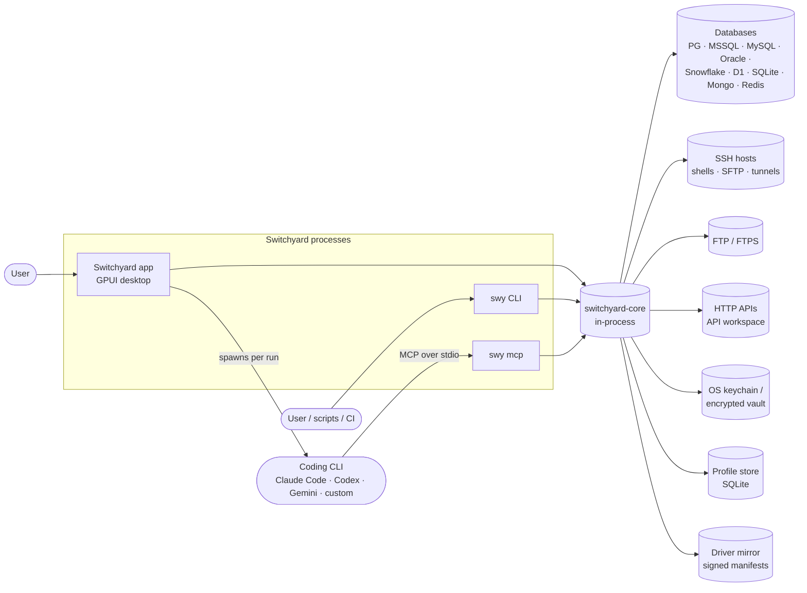
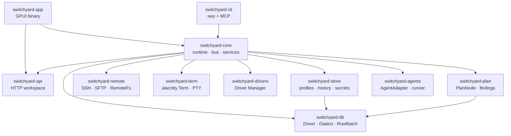
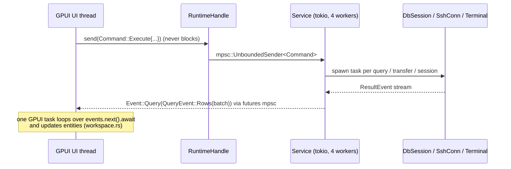
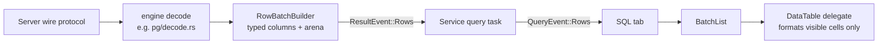
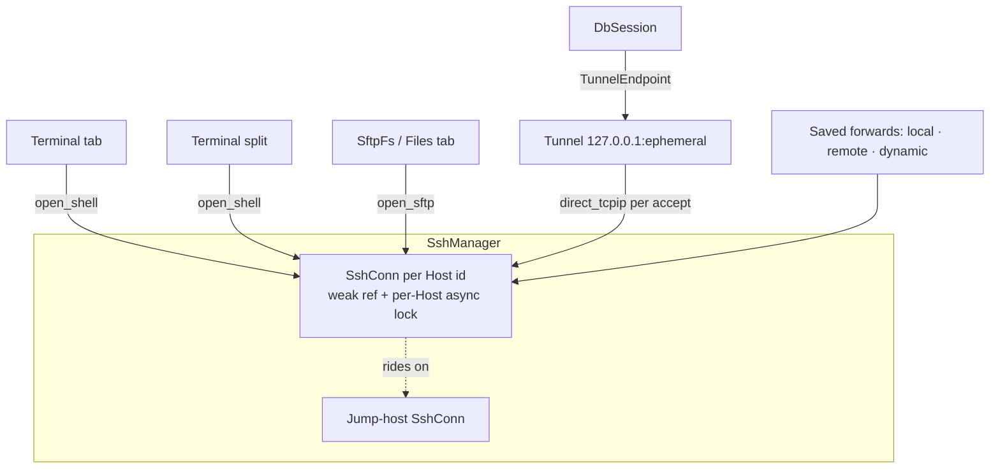
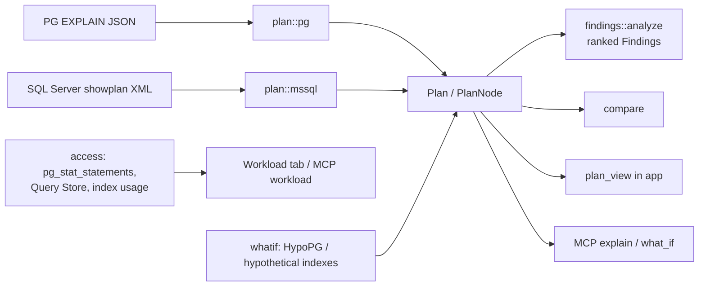
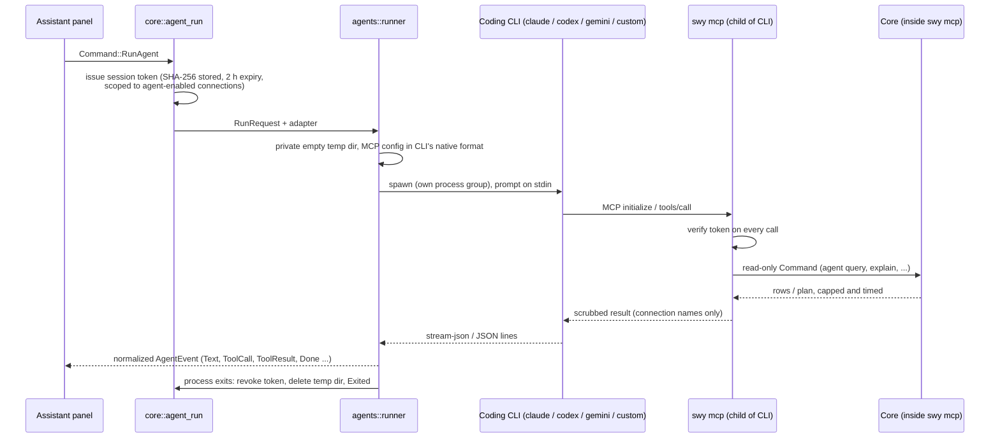
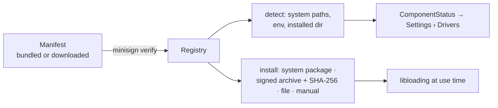
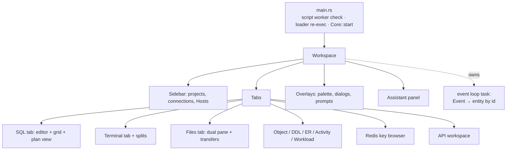

# Switchyard — Design Architecture

This document describes how Switchyard is built: the processes, crates, threads and data
flows, and the rules that hold them together. `docs/SPEC.md` says what the product does;
`docs/DECISIONS.md` records why individual calls were made. This file is the map between
them. Where it and the code disagree, the code wins. Fix this file.

## 1. System context



Switchyard is three entry points over one library:

| Process | Binary | Role |
| --- | --- | --- |
| Desktop app | `switchyard-app` | GPUI windows. Starts `Core` and renders events. |
| CLI | `swy` (`switchyard-cli`) | Starts its own `Core` on the same profile store and drives it over the same bus. |
| MCP server | `swy mcp` | Same binary. A stdio JSON-RPC server for coding CLIs. Read-only tools, with safety enforced in the server. |

There is no daemon. Each process owns its own `Core`. They share state only through the
profile store (SQLite), the keychain, and a few files in the data directory (agent session
tokens, `handoff.json` for `swy explain --open`).

## 2. Crate layout and dependency graph



| Crate | Owns | Must not |
| --- | --- | --- |
| `app` | Windows, workspace, sidebar, tabs (SQL, terminal, files, ER, plan, Redis, API, activity), grid, theme | Do I/O on the UI thread, call `block_on`, branch on `Engine` |
| `core` | Tokio runtime, `Command`/`Event` bus, `Service` (sessions, tunnels, terminals, transfers, agent runs, history) | Contain UI code |
| `store` | Domain model (`Profile`, `Host`, `DbConnection`, `FileConnection`), SQLite store, `SecretStore` impls | Know about sessions or the runtime |
| `db` | `Driver`/`DbSession`/`Dialect` traits, `Value`, `RowBatch`, `ResultEvent`, guard, one module per engine | Depend on `remote`. Tunnels arrive as `TunnelEndpoint`. |
| `remote` | `SshManager` (one session per Host), tunnels, known hosts, X11/agent forwarding, `RemoteFs` (local, SFTP) | Know about databases |
| `term` | `Terminal` over `alacritty_terminal`, `Feeder`, `Snapshot`, input encoding, local PTY | Render anything |
| `drivers` | Component manifests, detection, signed install, `libloading`, GSSAPI FFI, Oracle loader path | Be required at startup |
| `plan` | `Plan`/`PlanNode`, PG JSON and showplan XML parsers, capture, findings, compare, access stats, what-if | Expose engine plan formats past its parsers |
| `agents` | `AgentAdapter` per coding CLI, runner (temp dir, process group, cancel), `AgentEvent` | Leak CLI-specific types to the UI |
| `api` | Collections, environments, request compiler, import/export, cookies, OAuth, `pm.*` script sandbox | Use GPUI |
| `cli` | `swy` commands, MCP server and tools, output scrubbing | Duplicate connection or query logic |

Notes on the graph as built:

- `store → db`: the domain model uses `db`'s `Engine` and config types. `plan → db` for the same reason.
- `app → api` directly, in addition to `core`'s re-export. The API workspace's editor
  models are plain data the UI edits.
- `core` re-exports every lower crate (`switchyard_core::db`, `::plan`, ...), so `app` and
  `cli` normally import through `core`.
- `TunnelEndpoint` is defined in `db` and re-exported by `core`, so drivers never depend on `remote`.

## 3. Runtime model: UI thread, tokio runtime, bus



- **`Core::start(ServiceConfig)`** builds a multi-thread tokio runtime (`switchyard-io`,
  4 workers), creates `Service`, and returns `(Core, EventReceiver)`. Dropping `Core` shuts
  the runtime down.
- **Commands in**: `RuntimeHandle::send(Command)` on a tokio unbounded channel. The handle
  is cheap to clone and is also used for `spawn` / `spawn_blocking` of one-off work the UI
  awaits from a GPUI task.
- **Events out**: `EventReceiver` is a `futures` unbounded receiver. It is executor-agnostic,
  so a GPUI task awaits it directly. `workspace.rs` holds the single event loop and routes
  each `Event` to the entity that owns its id (`SessionId`, `QueryId`, `TermId`, `RequestId`, ...).
- **Ordering**: terminal input and resize commands run inline on the command loop, not on
  spawned tasks, because spawned tasks reordered keystrokes. Everything slow is spawned.
- **Ids**: the app allocates ids from 1. `swy` allocates from 2^40, so ids from the two
  never collide in shared history.

The bus covers the whole product surface. Command groups: profiles and secrets, DB
sessions and queries, transactions, introspection, plans and workload, Redis, history,
snippets, favorites, workspace persistence, file system and transfers, Driver Manager,
SSH config import, terminals and tunnels, agent runs, and interactive prompt answers.
The events mirror them, plus prompts (`HostKeyPrompt`, `SecretPrompt`,
`InteractivePrompt`, `EntraDeviceCode`), `Toast` and `Error`.

### Prompts flow back through the bus

Work on the runtime sometimes needs the user: an unknown host key, a passphrase, MFA, or an
Entra device code. `BusPrompter` emits a prompt event and parks the task on a oneshot. The
UI answers with `Command::AnswerPrompt`. The runtime never opens UI, and the UI never blocks.

## 4. Database layer

### Contracts (`switchyard-db`)

```rust
pub trait Driver: Send + Sync {
    fn engine(&self) -> Engine;
    fn dialect(&self) -> &dyn Dialect;
    fn requirements(&self, cfg: &DbConfig) -> Vec<ComponentId>;   // checked by Driver Manager
    fn connect<'a>(&'a self, cfg: &'a DbConfig, via: Option<TunnelEndpoint>, ..)
        -> BoxFuture<'a, Result<Box<dyn DbSession>>>;
}

pub trait DbSession: Send {
    fn execute<'a>(&'a mut self, sql: &'a str, params: &'a [Value]) -> BoxFuture<'a, Result<ResultStream>>;
    fn cancel_handle(&self) -> CancelHandle;
    fn introspect(&mut self, scope: IntrospectScope) -> BoxFuture<'_, Result<CatalogChunk>>;
    fn begin / commit / rollback(&mut self) -> BoxFuture<'_, Result<()>>;
    fn in_transaction(&self) -> bool;
    fn server_version(&self) -> String;
    fn is_closed(&self) -> bool;
}
```

The traits return `BoxFuture` (no `async-trait`; see DECISIONS 2026-10-05). `Dialect` owns
everything that differs by SQL flavor: identifier quoting, script splitting (with a shared
lexer that handles strings, comments, dollar quotes, `GO`, Oracle `q'..'`), row/CRUD/DDL
templates, parameter discovery and binding, literals, error positions, keywords, folds,
and the `sqlparser` dialect used by the guard.

### Engines

One module per engine under `db/src/`: `pg`, `mssql`, `mysql`, `oracle` (ODPI-C, Instant
Client loaded at runtime), `snowflake` (SQL API v2), `d1` (HTTP), `sqlite`, `mongo`,
`redis`. `Engine::is_sql()` is false for MongoDB and Redis. Redis gets a key browser
(`RedisOpen` / `RedisScan` / ...), not a `DbSession` SQL tab.

### Result streaming



- `ResultStream = BoxStream<'static, Result<ResultEvent>>` yields `Columns`, `Rows(RowBatch)`,
  `Notice`, `NextResultSet` and `Done(Completion)`.
- `RowBatch` is columnar: typed buffers per column, strings and bytes in an arena. The first
  batch is small, so first rows show quickly. Later batches are up to `DEFAULT_BATCH_ROWS` (1,000).
- **Fetch limit pauses, it does not drop.** At the limit (default 10,000) core stops polling
  and TCP back-pressure holds the server. `FetchMore` resumes. `Cancel` sends the server
  cancel and drops the stream.
- The grid never copies data. Sorting and filtering keep a permutation vector over `BatchList`.

### Sessions

- One `DbSession` per SQL tab (tabs run concurrently and keep their own transactions), plus
  one catalog session per explorer, so introspection never waits behind a long query.
- `Service.sessions: HashMap<SessionId, Arc<SessionSlot>>`. A running query is registered in
  `Service.queries` with its `CancelHandle`, so the UI can always cancel it.
- PostgreSQL cancel opens a second connection. Because it goes to the same
  `TunnelEndpoint`, it works through SSH.

### Guards (defense in depth)

`db::guard` classifies statements with `sqlparser`, never regex. The UI pre-checks to show
the confirmation dialog. Core re-checks every statement: it refuses unconfirmed destructive
statements on Production and any write on a read-only connection. Unparseable SQL is never
treated as read-only.

## 5. Remote layer: SSH, tunnels, files, terminals



- **One SSH session per Host.** `SshManager` keeps a weak reference per Host id behind a
  per-Host async lock, so concurrent opens share one login. New sessions linger 60 s with no
  users, so a test followed by a connect does not ask for MFA twice.
- **Tunnels.** One tunnel per (Host, target host, target port), shared by every DB session
  that needs it, with creation serialized. It closes with its last session. Stopping a tunnel
  ends the sessions that use it, with a message saying why.
- **Host keys.** Strict checking with Switchyard's own `known_hosts` reader. The user's file
  is read-only, and trusted keys go to Switchyard's file. A changed key blocks the
  connection until the user explicitly accepts it (`AcceptChangedHostKey`).
- **Agents.** `SSH_AUTH_SOCK`, 1Password's socket, the Windows OpenSSH pipe and Pageant.
  Agent and X11 forwarding are opt-in per Host.
- **Files.** `RemoteFs` is implemented by `LocalFs` and `SftpFs`. FTP/FTPS (`suppaftp`) is
  planned behind the same trait but not built yet.
  `core::files` runs the transfer queue: parallel transfers, pause, resume from offset,
  conflict policy (`OnConflict`), and remote edit with a modification-time conflict check.
- **Terminals.** `term::Terminal` wraps `alacritty_terminal::Term` behind its `FairMutex`.
  The I/O side writes through a `Feeder`, which parses either SSH channel bytes or local PTY
  output. The UI reads `Snapshot`s. Output is coalesced into one `TerminalWake` per batch,
  so a flood costs at most one snapshot per frame. The view is Switchyard's own canvas
  element (no GPL Zed code). Keystrokes are never logged.

## 6. Query plans and optimization (`switchyard-plan`)



- **One plan model.** Engine output is parsed once, in `plan::pg` or `plan::mssql`. Findings,
  compare, the UI and MCP see only `PlanNode`.
- **`capture`** runs `EXPLAIN` or showplan on a session. Actual plans (`ANALYZE`,
  `STATISTICS XML`) execute the statement, so DML runs inside a transaction that is always
  rolled back. A rollback failure is its own error (`PlanError::Rollback`), because the
  session's state is then unknown.
- Optional extensions (`pg_stat_statements`, HypoPG, Query Store) are detected. When they
  are missing, or permissions are missing, the result is a hint, not an error.

## 7. Agents and MCP



- **Adapters** (`claude`, `codex`, `gemini`, `custom`) only know how to invoke their CLI and
  parse its output into `AgentEvent`. The runner owns the temp directory, process group,
  cancel (SIGTERM to the group, then SIGKILL after 2 s; `taskkill /T` on Windows) and cleanup.
- **The MCP server is the safety boundary.** Its tools are `list_connections`, `list_tables`,
  `describe_table`, `run_query`, `explain`, `workload` and `what_if`, and all are read-only:
  - visible connections: those with `agent_access` on, narrowed by the run's token;
  - `run_query`: a single SELECT/WITH (`sqlparser`), run in a read-only transaction or one that is always rolled back, 200-row default cap (1,000 max), 30 s default timeout (120 s max) with a server-side cancel;
  - estimated plans only. Actual plans need approval in the app, and no tool runs DDL;
  - every result and error is scrubbed of hosts, ports, users and database names;
  - every call goes to history tagged `agent` and `agent:<cli>`.
- CLI permissions are locked down where the CLI supports it (for Claude Code: no built-in
  tools, strict MCP config, MCP-only allow-list). This is extra protection only. The guarantees
  hold even if a CLI ignores it.

## 8. Persistence and secrets

| Data | Where | Crate |
| --- | --- | --- |
| Profiles, Hosts, connections, forwards, workspace and tab buffers, settings, snippets, favorites, query history, schema cache | SQLite in the data dir (`AppPaths` via `directories`, or portable mode) | `store` |
| API collections, environments, history, runs | Workbench SQLite store | `api` |
| Passwords, passphrases, tokens, Entra token cache | OS keychain (`keyring`), or a ChaCha20-Poly1305 vault with an Argon2-derived key | `store::secrets` |
| Agent session tokens | `<data>/agent-tokens/<sha256>.json` (hash only) | `core::agent_run` |
| Optional native drivers | `<data>/drivers`, installed from signed manifests | `drivers` |

- Profiles store `SecretRef`s, never secrets. Secrets are `secrecy::SecretString`, and
  their `Debug` impls redact (tested in `db::driver`).
- `SecretBackendChoice` selects the backend. The vault is used when no Secret Service exists, or
  when it is forced with `SWITCHYARD_SECRETS=vault` (CLI and CI).
- Windows Credential Manager's 2,560-byte limit is handled by splitting values over
  `<key>#1..n`.

## 9. Driver Manager (`switchyard-drivers`)



Every built-in protocol (PostgreSQL, SQL Server, D1, SSH, SFTP) is pure Rust and compiled in.
Native components are optional: Oracle Instant Client (ODPI-C), GSSAPI for Kerberos,
corporate CAs and similar. A missing component disables only the feature that needs it.
Oracle on Linux needs the loader path at process start, so `main` re-executes once with
`LD_LIBRARY_PATH` set and restores the original value for child processes.

## 10. Application layer (`switchyard-app`)



- UI kit: GPUI with `gpui-component` (via `gpui-kit` 0.7). The SQL editor uses tree-sitter
  highlighting. Its folds come from the dialect (`folds.rs`).
- Every long list is virtualized: grid rows and columns, schema tree, file lists, scrollback.
- `main` checks `--switchyard-api-script-worker` before starting GPUI. The API script
  sandbox re-executes the app binary as an isolated worker.
- Environment labels (Production and others) drive the accent color, confirmations and
  read-only locks. The UI reads them from the profile and never from the engine.

## 11. Cross-cutting concerns

- **Errors:** a `thiserror` enum per library crate (`DbError`, `PlanError`, `DriverError`,
  `StoreError`, `CoreError`, `AgentError`, ...). `anyhow` only at the top of `app` and `cli`.
- **Cancellation:** queries (`CancelHandle`), transfers (`CancelTransfer` / `PauseTransfer`),
  agent runs (`CancelAgent`) and tunnels (`StopTunnel`) can all be stopped from the UI.
- **Logging:** `tracing` with spans per session and per query (id, engine, host alias).
  Logs never contain credentials, keystrokes or vault passwords.
- **TLS:** `rustls` with the `ring` provider throughout (russh too). Certificate
  verification is on, and trust exceptions are per connection and pinned.
- **Licensing:** Apache-2.0. No GPL code. Zed's editor and terminal crates are off-limits.
- **Platforms:** one codebase for macOS, Windows and Linux. Platform code is limited to
  keychain backends, SSH agent discovery, GSSAPI struct packing, the Oracle loader and packaging.

## 12. Architecture invariants (checklist for reviews)

1. No I/O and no `block_on` on the UI thread. All work goes through `RuntimeHandle`.
2. Results stream as `ResultEvent`s in columnar `RowBatch`es. Nothing is materialized into rows of strings.
3. Every long-running operation has a cancel path reachable from the UI.
4. No `if engine == X` outside a driver module. Differences go through `Dialect` / `Driver`.
5. Optional native libraries load at runtime through the Driver Manager.
6. One SSH session per Host. Tunnels, terminals and SFTP share it.
7. Plans are converted into `PlanNode` at the edge. Nothing else reads engine plan formats.
8. `app` and `swy` share `core`. `cli` has no connection or query logic of its own.
9. Agent safety is enforced in `swy mcp`, never delegated to the CLI's settings.
10. Secrets live only in the keychain or the vault, and never appear in logs, history or exports.

## 13. Extension points

| To add | Implement | Touch |
| --- | --- | --- |
| A database engine | `Driver`, `DbSession`, `Dialect` in `db/src/<engine>/` | `Engine` enum, `Service.drivers` registration, insta snapshots for catalog SQL |
| A plan source | Parser into `Plan` in `plan/src/<engine>.rs` | `capture` |
| A findings rule | A `Rule` in `plan::findings` | Thresholds/defaults |
| A coding CLI | `AgentAdapter` + `StreamParser` in `agents/src/<cli>.rs` | `AgentKind`, history tag |
| A file protocol | `RemoteFs` | `FileProtocol` in the store model |
| An optional native component | Manifest entry + detection | `drivers::registry` |
| An MCP tool | Tool def + handler in `cli/src/mcp` (read-only, scrubbed, recorded) | `instructions.md` |
